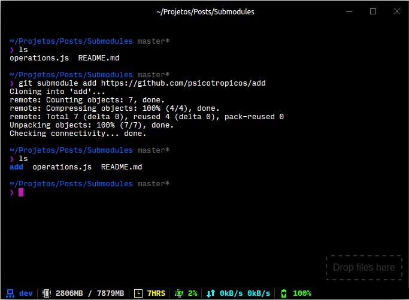
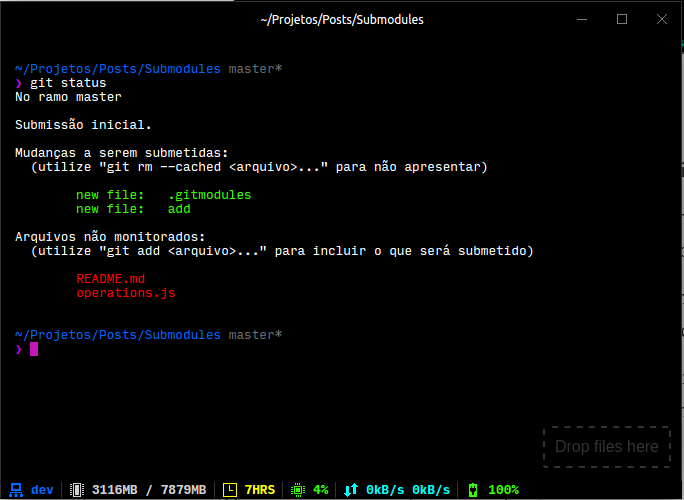
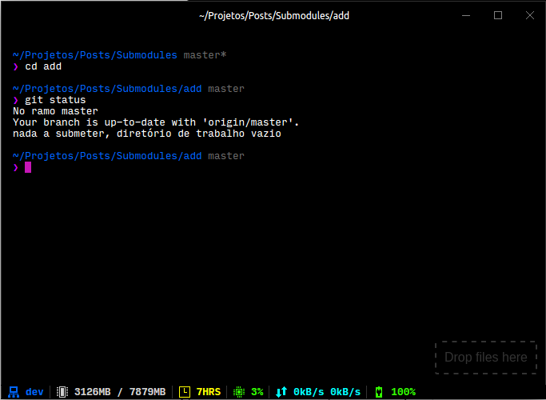

O Git é um chuchuzinho, né? Não tem como não gostar. E uma das coisas que eu mais gosto nele (Além de tudo que é óbvio) é dos submódulos.
Eles nos permitem “inserir” um repositório Git dentro de outro e trabalhar nele separadamente.
Então se você esta trabalhando num projeto, e acha que alguma parte dele pode ter seu desenvolvimento separado, ser independente, é só criá-lo num repositório diferente e adicioná-lo como submódulo, como na imagem abaixo.

Muita coisa acontece aqui e eu vou explicar:
- No primeiro comando eu listo os arquivos do diretório;
- Então eu adiciono um submódulo com o comando git submodule add <url/do/repositório> <destino/do/submódulo>;
- O repositório é clonado como em um clone “normal”, e como eu não defini o parâmetro de destino, ele foi clonado para o diretório atual;
- Por fim, eu listo os arquivos novamente e o submódulo está ali, como uma parte do projeto mas ao mesmo tempo como um repositório independente.

Vamos ver como está o status do git agora.

Temos duas coisas para ver aqui, primeiro de tudo é que foi criado um arquivo chamado .gitmodules que é onde fica a lista de todos os submódulos desse projeto, segundo é que o módulo aparece como uma simples adição de arquivos para o git. Entretanto:

Entrando na pasta recém adicionada, podemos ver que ela é um repositório git independente. Você pode fazer alterações, commitar, dar push e pull.
Tudo isso de maneira recursiva, você poder ter submódulos dentro de submódulos que estão dentro de outros submódulos e assim por diante.
Essa capacidade do git nos da uma flexibilidade incrível para trabalhar de maneira modular e mais organizada e certamente vale a pena ser estudada.
Por hoje é só, espero ter ajudado em algo. Feedbacks são muito bem vindos, bons ou ruins, positivos ou negativos. Talk to me.

